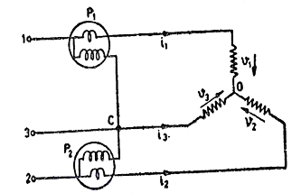
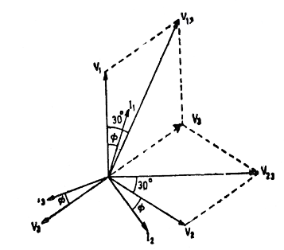

## Introduction

All the electrical equipment and machines work on supplying electric power and dissipate large amounts of energy. The supplied power is usually measured in terms of watts using a device namely wattmeter. A wattmeter is also called as deflection meter which is mainly used in electrical labs. It not only measure power in terms of watts but also measures in terms of Kilowatts and Megawatts. The wattmeter usually consists of two coils <b>"CC</b>" current coil which is usually connected in series with load current and a voltage/pressure/ potential coil "<b>PC</b>", this coil is usually connected across the load circuit. The electrical power can be represented in three forms they are Active power, Reactive power and Apparent power. The following theory describes the two wattmeter method at balanced load condition. 

### What is Two Wattmeter Method? 
A three-phase two wattmeter measures the current and voltage from any of the 2 supply lines of 3 phase corresponding to the 3rd supply line of 3 phase. The 3 phase two Wattmeter is said to be at a balanced load condition if the current in every phase lag at an angle "<b>φ</b>" with phase voltage. 

### Construction of Two Wattmeter Method
  The 3-phase power of a 3-phase circuit can be measured using three ways:  
* Three Wattmeter Method  
* Two Wattmeter Method  
* One Wattmeter Method 

The main concept of two Wattmeter with 3 phase voltage is to balance the 3 phase load by satisfying the condition of current lagging at an angle ‘φ’ with the phase voltage. The circuit diagram of 3 phase two wattmeter is shown below: 

  

**Fig. 1 Three phase power measurement using Two Wattmeter**

 It consists of two Wattmeters like P1 and P2, Where each wattmeter has a current coil ‘CC’ and a pressure coil ‘PC’. Here, One end of wattmeter P1 is connected to ‘1’ terminal whereas one end of wattmeter P2 is connected to ‘2’ terminal. The circuit also consists of 3 resistors which are constructed in a star topology. The two ends of resistors are connected to 2nd terminals of a wattmeter whereas the third terminal of the resistor is connected to 3.

#### **Derivation of Two Wattmeter Method** 
Two Wattmeter is used to determine two main parameters they are,
* Active Power
* Power factor  

Consider the load used as resistive load which is represented by following the phasor diagram as shown below.
 

 

 

**Fig 2. Phasor diagram for balanced Star Connected Load**

Instantaneous power consumed by load = v1i1 + v2i2 + v3i3

Let us consider two wattmeters connected to measure power in three phase circuits as shown in Fig. 1 Star connection.

Instantaneous reading of P1 wattmeter p1 = i1 (v1-v3).

Instantaneous reading of P2 wattmeter p2 = i2 (v2-v3). 

Sum of Instantaneous readings of two wattmeters = p1 + p2

$=i_1 (v_1-v_3) + i_2 (v_2-v_3) = v_1i_1 + v_2i_2 - v_3 (i_1+i_2)$

From Kirchhoff's law,

$i_1 + i_2 + i_3 = 0$ 

$i_3 = -(i_1+i_2)$

Therefore, Sum of Instantaneous readings of two wattmeters = v1i1 + v2i2 + v3i3

Therefore, The sum of the two wattmeter reading is equal to the power consumed by the load. This is irrespective of whether the load is balanced or unbalanced.

Let V1, V2, V3 be the rms values of phase voltage and I1, I2, I3 be the rms values of phase currents.

The load is balanced, therefore

Phase voltages V1 = V2 = V3 = V (say)

Line voltages V13 = V23 = V12 = √3V

Phase currents I1 = I2 = I3 = I (say)

Line currents I1 = I2 = I3 = I

Power factor = cosφ 

The phase currents lag the corresponding phasor voltages by an angle φ.

The current through wattmeter P1 is I1 and voltage across its pressure coil is V13. I1 leads V13 by an angle (30° - φ).

Therefore, Reading of P1 wattmeter, 

$P_1 = V_{13}I_1cos(30° - φ) = √3VIcos(30° - φ)$

The current through wattmeter P2 is I2 and voltage across its pressure coil is V23. I2 lags V23 by an angle (30° + φ).

Therefore, Reading of P2 wattmeter, 

$P_2 = V_{23}I_2cos(30° + φ) = √3VIcos(30° + φ).$

Sum of reading of two wattmeters, 

$P_1 + P_2= √3VI[cos(30° - φ) + cos(30° + φ)] = 3VIcosφ$

This is the total power consumed by load.

Therefore, Total power consumed by load P = P1 + P2

Difference of readings of two wattmeters

$P_1-P_2 = √3VI[cos(30° - φ) - cos(30° + φ)] = √3VIsinφ$

$\frac{P1-P2}{P1+P2} = \frac{√3VIsinφ}{3VIcosφ} = \frac{tanφ}{√3}$

$φ = tan^{-1}√3\frac{P1-P2}{P1+P2}$

Power factor, 

$cosφ = cos \left (tan^{-1}√3\frac{P1-P2}{P1+P2} \right )$

### Advantages of Two Wattmeter Method:

* Both balanced and unbalanced load can be balanced using this method.
* In a star connected load, it is optional to connect neutral point and wattmeter.
* In a delta, connected load connections need not be opened to connect wattmeter.
* 3 phase power can be measured using two wattmeter.
* Both power and power factor is determined on a balanced load condition.

### Disadvantages of Two Wattmeter Method:
* Not suitable for 3 phase, 4 wire system.
* Primary windings P1 and secondary windings P2 must be identified correctly to prevent incorrect results.  

### Applications of Two Wattmeter
* Wattmeters are used to measure the power consumption of any electrical appliances.

