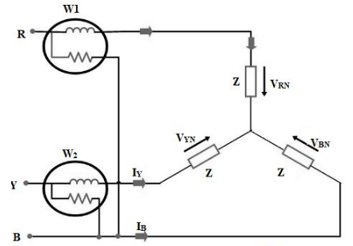
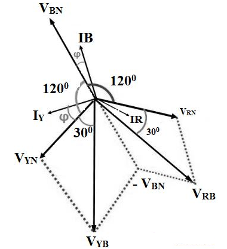

### Introduction
&nbsp;&nbsp;&nbsp;&nbsp;&nbsp;&nbsp;&nbsp;&nbsp;&nbsp;&nbsp;&nbsp;&nbsp;All the electrical equipment and machines work on supplying electric power and dissipate large amounts of energy. The supplied power is usually measured in terms of watts using a device namely wattmeter. A wattmeter is also called as deflection meter which is mainly used in electrical labs. It not only measure power in terms of watts but also measures in terms of kilowatts and megawatts. The wattmeter usually consists of two coils “CC” current coil which is usually connected in series with load current and a voltage/ pressure / potential coil “PC”, this coil is usually connected across the load circuit. The electrical power can be represented in three forms they are real power, reactive power, and apparent power. The following article describes the two wattmeter method at balanced load condition.  

### What is Two Wattmeter Method? 
A three-phase two-watt meter measures the current and voltage from any of the 2 supply lines of 3 phase corresponding to the 3rd supply line of 3 phase. The 3 phase 2 wattmeter is said to be at a balanced load condition if the current in every phase lag at an angle “φ” with phase voltage.  

### Construction of Two Wattmeter Method
  The 3-phase power of a 3-phase circuit can be measured using 3 ways they are,  
* 3 Wattmeter Method  
* 2 Wattmeter Method  
* 1 Wattmeter Method. 

The main concept of 2 Wattmeter with 3 phase voltage is to balance the 3 phase load by satisfying the condition of current lagging at an angle ‘φ’ with the voltage phase. The schematic diagram of 3 phase 2 wattmeter is shown below

  
  

**Fig 1. Three phase power measurement using Two Wattmeter**

 It consists of 2 wattmeters like W1 and W2, where each wattmeter has a current coil ‘CC’ and a pressure coil ‘PC’. Here, one end of wattmeter ‘W1’ is connected to ‘R’ terminal whereas one end of wattmeter ’W2′ is connected to’ Y’ terminal. The circuit also consists of 3 inductors ‘Z’ which are constructed in a star topology. The 2 ends of inductors are connected to 2 terminals of a wattmeter whereas the third terminal of the inductor is connected to B.

#### **Derivation of Two Wattmeter Method** 
Two Wattmeter is used to determine two main parameters they are,
* Power factor
* Reactive power.  

Consider the load used as an inductive load which is represented by following the phasor diagram as shown below.
 

 

 

**Fig 2. Phasor diagram**

&nbsp;&nbsp;&nbsp;&nbsp;&nbsp;&nbsp;&nbsp;&nbsp;&nbsp;&nbsp;&nbsp;&nbsp; The voltages VRN, VYN, and VBN are electrically 1200 in phase with one other, we can observe that the current phase lags at the “φ0 ” angle with voltage phase.

#### The current in wattmeter W1 is represented as
W1 = IR …….. (1)
#### where IR is current

#### The potential difference across the wattmeter W1 coil is given as
W1 = ~ VRB = [ ~ VRN – ~ VBN ] ……… (2)  

#### Where  VRN and VBN are voltages
#### The phase difference between the voltage ‘VYB‘ and current ‘IY ‘ is given as (30° + φ )
#### Hence the power measured by wattmeter is given as
W2 = VYB IY cos ( 30° + φ ) ………….. (3)  

#### At balanced load condition,

IR = IY = IB = IL and ………….. (4)   
VRY = VYB = VBR = VL ………… (5)  

#### Therefore we obtain wattmeter readings as

W1 = VL IL cos( 30° – φ ) and ……………. (6)  
W2 = VL IL cos ( 30° + φ ) …………….. (7)   

### Total Power Derivation 
#### The total wattmeter reading is given as  
W1 + W2 = VL IL cos( 30° – φ ) + VL IL cos ( 30° + φ ) ………….. (8)  
= VL IL [ cos( 30° – φ ) + cos ( 30° + φ ) ]  
= VL IL [ cos 30° cos φ + sin 30° sin φ + cos 30° cos φ – sin 30° sin φ ]  
= VL IL [ 2 cos 30° cos φ ]  
= VL IL [ (2 √3 / 2 ) cos 30° cos φ]  
= √3  [ VL IL cos φ ]    ……… (9)  
W1 + W2 = P ….. (10)  
#### Where ‘P’ is the total observed power in a 3-phase balanced load condition.   

### Power Factor Derivation 

&nbsp;&nbsp;&nbsp;&nbsp;&nbsp;&nbsp;&nbsp;&nbsp;&nbsp;&nbsp;&nbsp;&nbsp;It is the ratio between actual power observed by the load to apparent power flowing in the circuit.The power factor of three phase balanced load condition can be determined and derived from wattmeter readings as  
#### From equation 9
W1 + W2 = √3 VL IL cos φ  
Now W1 – W2  = VL IL [ cos( 30° – φ ) – cos ( 30° + φ ) ]  
= VL IL [ cos 30° cos φ + sin 30° sin φ – cos 30° cos φ + sin 30° sin φ ]  
= 2 VL IL sin 30° sin φ  
W1 – W2= VL IL sin φ ………….. (11)  

#### Dividing equations 11 and 9

[W1 – W2 \ W1 +W2] = VL IL sin φ / √3 VL IL cos φ      
Tan φ = √3 [W1 – W2\W1 +W2]  
#### The power factor of the load is given as 
cos φ = cos tan-1 [√3] [W1 – W2 \ W1 +W2] ………(12)  

### Reactive Power Derivation 
It is the ratio between complex power corresponding to storage and revival of energy rather than consumption.  
To obtain reactive power, we multiply equation 11 with  
√3 [W1 – W2 ]= √3 [VL IL sin φ] = Pr   
Pr = √3 [W1 – W2 ] …………. (13)      
Where Pr is the reactive power obtained from 2 wattmeters. 

### Advantages of Two Wattmeter 

* Both balanced and unbalanced load can be balanced using this method
* In a star connected load, it is optional to connect neutral point and wattmeter
* In a delta, connected load connections need not be opened to connect wattmeter
* 3 phase power can be measured using two wattmeter’s
* Both power and power factor is determined on a balanced load condition.

### Disadvantages of Two Wattmeter
* Not suitable for 3 phase, 4 wire system
* Primary windings W1 and secondary windings W2 must be identified correctly to prevent incorrect results.  

### Applications of Two Wattmeter
* Wattmeters are used to measure the power consumption of any electrical appliances and verify their power ratings.